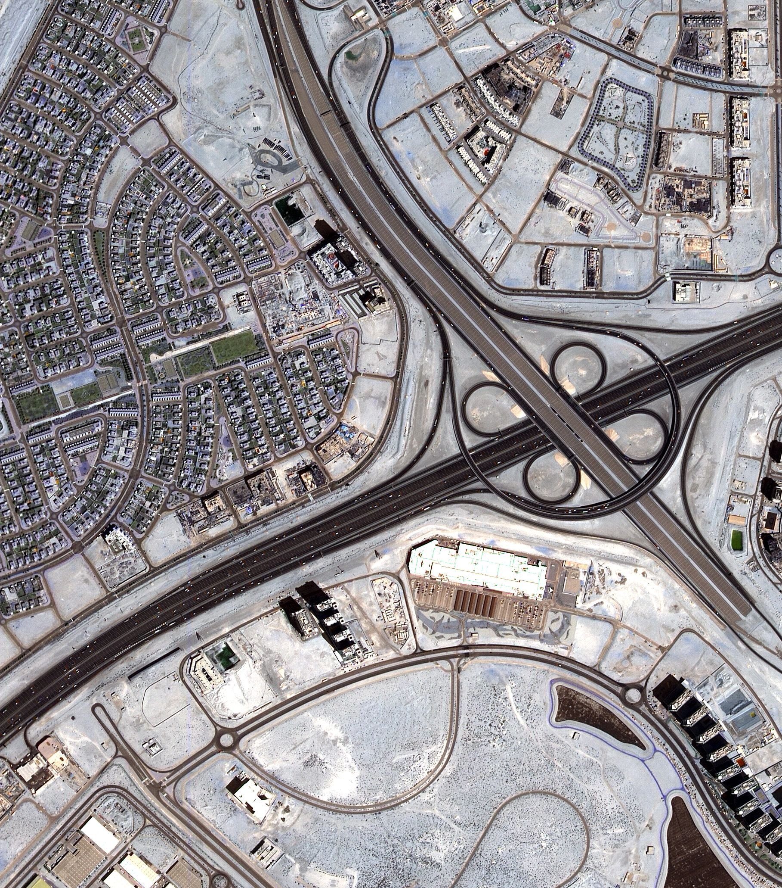
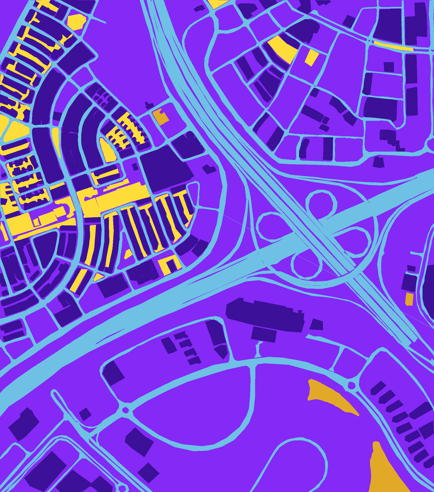
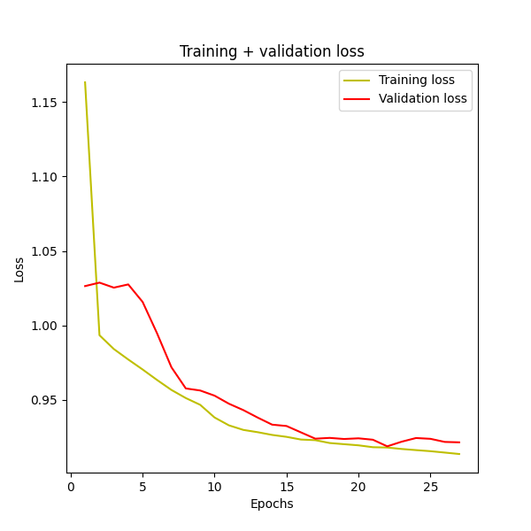
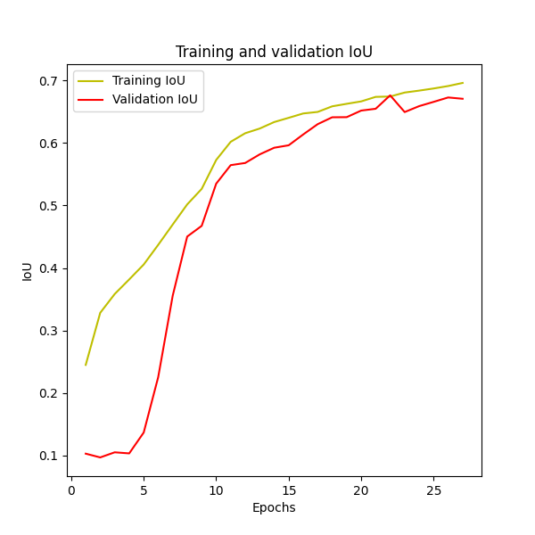
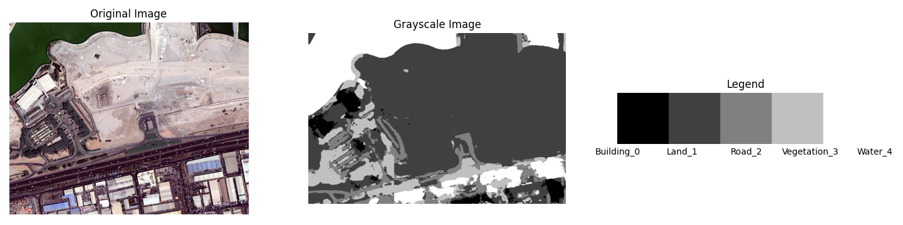
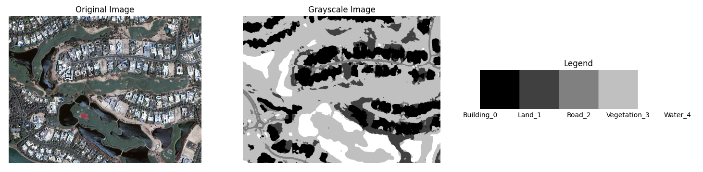
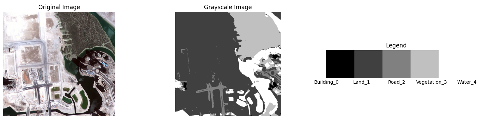

# IMAPCnn
The Deep Learning (DL) Image Processing use the Semantic segmentation of aerial imagery [[link]](https://www.kaggle.com/datasets/humansintheloop/semantic-segmentation-of-aerial-imagery/) from Satellite images of Dubai with 6 classes.

## 01 - Intro 

The U-Net [[link]](https://arxiv.org/abs/1505.04597/) Convolution Neural Network (CNN) was implemented by Robson Rogério Dutra Pereira (rrdpereira) [[link]](https://github.com/rrdpereira/), to perform the multiclass (6 classes in this case) semantic segmenataion.

## 02 - Dependences

A Miniconda [[link]](https://docs.conda.io/projects/miniconda/en/latest/miniconda-install.html) Python enviroment was create with 3.7.13 Python version and with the following main packages:
* tensorflow              2.5.0
* scikit-image            0.19.3
* scikit-image            0.19.3
* opencv-python           4.6.0.66
* numpy                   1.19.5
* matplotlib              3.5.2

## 03 - Dataset Sample

Each aerial satellite image have the corresponding mask image (labeled image) like the following sample:

  
    

Those images are located on the ***dataset_aerial_imagery*** folder. Three samples was remove from the train/test dataset and stored in ***sample*** folder to use as unseen data, applied after the training and validation.

## 04 - Training and Validation Results

U-Net support 128, 256 and 512 patches. For this description, the 50 epochs/256 patches training and validation was performed. The performance was verified by the metrics ***loss*** and ***jacard coeficient***, and give us the following results:

  
    

But is it possible to train with diffent patches and epochs sizes.

## 05 - Inference in high resolution images

A high resolution inference was done using the U-Net trained model with 50 epochs/256 patches, and created the following results:

  
  
  

## 06 - References

 * https://www.kaggle.com/datasets/humansintheloop/semantic-segmentation-of-aerial-imagery/

 * https://arxiv.org/abs/1505.04597/

 * https://docs.conda.io/projects/miniconda/en/latest/miniconda-install.html/